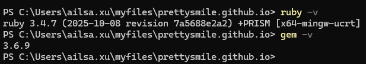

<!-- ---
title: How to Deploy
nav_order: 99
--- -->

# How to Deploy
這份文件說明如何部署專案。

## 1. 安裝 Ruby with Devkit
[Ruby+Devkit 3.4.7-1 (x64) ](https://rubyinstaller.org/downloads/)

確認版本




## 2. 安裝套件
Bundler 用來管理 Gem 套件，Jekyll 是靜態網站生成器
```
gem install bundler jekyll
```


## 3. Clone 你的 repo：
```
git clone https://github.com/prettysmile/prettysmile.github.io.git
cd prettysmile.github.io
```

## 4. 安裝依賴：
```
bundle install
```

## 5. 本地預覽：
```
bundle exec jekyll serve
```

## 6. 打開瀏覽器：
	http://localhost:4000


