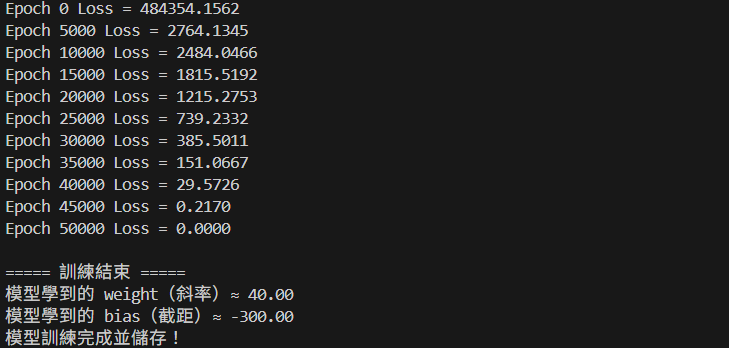
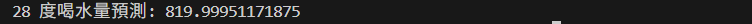

# PyTorch

## 介紹
- 目前最流行、學界與業界主流的機器學習框架。
- 讓工程師能更快寫出神經網路。
- 我們只需專注在模型本身，而不是底層矩陣計算。
- 大部分 LLM（GPT）都是基於 PyTorch。
- PyTorch 只是一個工作，幫你處理 AI 模型的工具，像程式套件一樣。

### 什麼是 AI 模型?
> 一個會自動猜答案的小盒子，盒子裡面就是一堆參數而已。<br>
> 用資料訓練它，讓它變聰明。

### 什麼是訓練? 
> 例如：<br>
> 小明每次說「這張圖片是狗」，然後 AI 猜錯了，你罵它 → 它就改答案。<br>
> 猜錯 → 修改<br>
> 猜錯 → 修改<br>
> 猜錯 → 修改<br>
> 猜對 → 修改很少<br>
> 
> 這就是 AI 訓練。（就是這麼簡單）

<br>

---

<br>

## 安裝步驟
1. Python 3.14.0。

2. 確認 python 可運行。
  ```bash
    py --version
  ```

3. 確認 pip 有加入環境變數裡，PATH 增加：
  ```bash
    C:\Users\{使用者}\AppData\Local\Programs\Python\Python314\Scripts
  ```

4. 確認 pip 可運行
  ```bash
    pip --version
  ```

5. 安裝套件
  ```bash
    pip install torch numpy
  ```

<br>

---

<br>

## 🤖 手動實作，讓 AI 學會：<br>「溫度越高，喝水越多，依照不同溫度，自動判斷喝水量」

### 1️⃣ 了解 PyTorch 專案的標準做法：
所有步驟：訓練 → 儲存 → 預測。
> 一支程式：只負責 ```訓練及儲存``` 模型。<br>
> 另一支程式：只負責 ```載入模型``` 做預測。<br>

### 2️⃣ 準備資料以及預期結果：

| 氣溫 | 喝水量 |
| ---- | ---- |
| 20 度 | 500 ml |
| 25 度 | 700 ml |
| 30 度 | 900 ml |

預期 AI 會學到：
```👉 喝水量 ≈ 氣溫 x 某個數字```

> AI 會自己找出那個數字，不用我們教它數學，它會自己找答案。


## 3️⃣ 執行「訓練」檔案 (water_model.py)
```python
# 訓練檔

import torch
import torch.nn as nn
import torch.optim as optim

# -----------------------------------------------------------
# 1. 建立一個 AI 小盒子，此處只有一個線性層。
# -----------------------------------------------------------
class WaterModel(nn.Module): # nn.Module 是 PyTorch 裡的「模型基底類別」。
    def __init__(self):
        super().__init__()
        self.linear = nn.Linear(1, 1) # Linear(1, 1) 表示：輸入特徵數（氣溫只有一個數字），輸出特徵數（喝水量只有一個數字）。

    def forward(self, x): # 模型「前向傳遞」的規則  #每次我們把資料丟進模型，PyTorch 就會自動呼叫 forward(x)。
        return self.linear(x)


if __name__ == "__main__":
    # -----------------------------------------------------------
    # 2. 準備訓練資料
    #    注意：在 PyTorch 裡，資料都是「矩陣（Tensor）」，此處為 2D，是二維陣列。
    # -----------------------------------------------------------
    x = torch.tensor([[20.0], [25.0], [30.0]])  # 氣溫（input）
    y = torch.tensor([[500.0], [700.0], [900.0]]) # 喝水量（output）    # 3 筆資料，每筆資料 1 個特徵。


    model = WaterModel() # 初始化模型

    # -----------------------------------------------------------
    # 3. 設定「AI 怎麼學」：
    #    設定 損失函數 criterion
    #    設定 優化器 optimizer
    #         lr = learning rate = 學習率 → 每次修正幅度
    #         lr = 0.01, Loss = nan, 代表 AI 看到自己猜錯，一次改超大，導致離正確答案超級遠，計算 Loss 時數字爆掉了。
    #                                這叫 梯度爆炸 (Gradient Explosion) 或 模型發散 (Divergence)。
    # -----------------------------------------------------------
    criterion = nn.MSELoss() # MSE → 平方誤差平均 → 適合數值預測問題（Regression） 

    # 這裡有 2 種優化器：SGD 以及 Adam。
    # optimizer = optim.SGD(model.parameters(), lr=0.001)  # SGD = 固定大小的步伐。
    optimizer = torch.optim.Adam(model.parameters(), lr=0.01) # Adam = 會自動調整步伐(更聰明更穩)。


    # -----------------------------------------------------------
    # 4. 開始訓練，設定學習次數
    # -----------------------------------------------------------
    for epoch in range(50001):
        # 讓模型根據「氣溫x」猜「喝水量y」。
        pred = model(x)

        # 看看猜得離正確答案，相差多少。
        loss = criterion(pred, y) # pred = AI 的猜測, y = 喝水量y (真實答案), loss = AI 的猜測距離正確答案的偏差。

        # 清空前一次的梯度，確保每一次修正都是「針對這一次輸入」。
        optimizer.zero_grad()

        # PyTorch 會自動計算每個參數（weight / bias）應該往哪個方向改，以及改多少 → 這就是梯度（gradient）。
        loss.backward()

        # 更新模型參數，optimizer 會按照梯度 + learning rate → 更新 weight / bias。
        optimizer.step()

        # 每 N 次印一次，看訓練狀況
        if epoch % 5000 == 0:
            print(f"Epoch {epoch} Loss = {loss.item():.4f}") # Loss 越小越好，越接近正確答案! 0=模型幾乎完美。


    # -----------------------------------------------------------
    # 5. 訓練完成
    # -----------------------------------------------------------
    weight = model.linear.weight.item()
    bias = model.linear.bias.item()

    print("\n===== 訓練結束 =====")
    print(f"模型學到的 weight（斜率）≈ {weight:.2f}")
    print(f"模型學到的 bias（截距）≈ {bias:.2f}")

    torch.save(model.state_dict(), "water_model.pth") # state_dict() → 取得模型所有參數（weight, bias…），並儲存。

    print("模型訓練完成並儲存！")
```


> 結果解讀：<br>
> 模型學到的 weight（斜率）≈ 40.00 <br>
> 模型學到的 bias（截距）≈ -300.00 <br>
> 這代表 AI 學到的公式是：```👉 喝水量 ≈ 氣溫 × 40 + -300``` <br>
> 可以看到 AI 已經成功「學會」了規律。


## 4️⃣ 執行「預測」檔案 (predict_model.py)
```python
# 預測檔

# predict_model.py
import torch
import torch.nn as nn
from water_model import WaterModel  # 只匯入模型類別

# 2️⃣ 建立模型
model = WaterModel()

# 3️⃣ 載入已存好的權重
model.load_state_dict(torch.load("water_model.pth"))

# 4️⃣ 切換到評估模式（只做預測，不計算梯度）
model.eval()

# 5️⃣ 丟新資料進去預測
x_new = torch.tensor([[28.0]], dtype=torch.float32)  # 新的氣溫
y_pred = model(x_new)

print("28 度喝水量預測:", y_pred.item())
```


> 結果解讀：<br>
> 氣溫 28 度 → 喝水量 ≈ 28 × 40 + (-300) ≈ 820 ml
