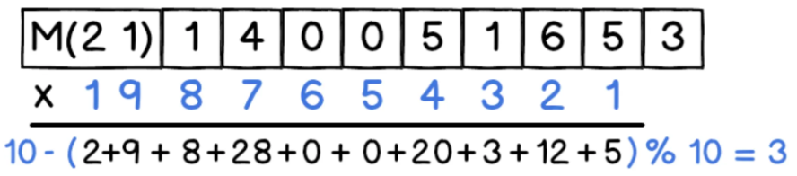
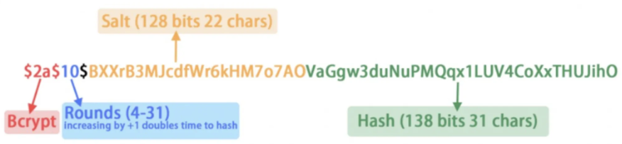

# 演算法

## 🔐 編碼 Encode

編碼並不會修改資料、也沒有任何加密的效果，單純就是 換個方式來表達資料 而已。

<br>

### 🌐 javascript encodeURI / decodeURI

例如：瀏覽器網址的url。

他們是用來把網址中的特殊字元（空白、標點符號等等）編碼成符合 URL 的格式。

```
https://www.google.com/search?q=創世神
https://www.google.com/search?q=%E5%89%B5%E4%B8%96%E7%A5%9
```

所以即便電腦不支援顯示中文，或是某些比較舊的瀏覽器無法貼中文網址，

也還是可以透過編碼後的網址連到目標網站。

<br>

### 🌐 Base64

Base64 是一種可以把二進位的資料編碼成 ASCII 字元的方法。
```
cat hello.png | base64 //把圖片編碼成 Base64 格式
echo {那一大串} | base64 -D > image.png //將base64格式，轉成原本的圖片
```

---

## 🔐 加密演算法Encrypt

加密演算法一定要有相應的解密演算法，即資料轉換必須是可逆的或雙向的。

例如：a=b+6，則b=a-6。

跟編碼有點像，但加解密必須要有金鑰（Key）才能進行。

<br>

### 🌐 AES 對稱加密演算法

所謂的對稱就是說加密解密 都是用同一個 key。

安全性高不易被破解，加密檔案的速度也非常快。

```
openssl aes-256-cbc -in <input> -out <output> //加密，輸入指令後會請求輸入密碼
openssl aes-256-cbc -d -in <input> -out <output> //解密，輸入指令後會請求輸入密碼
```

小心忘記密碼，那就真的 gg 了，因為 AES 加密後的檔案即便用超級電腦來破解，也要超過十億年。

缺點：因為網路環境是不安全的，所以除非把Alice當面約出來講密碼是什麼，不然只要是透過網路把密碼傳給對方，就有機會被中間人拿走。

<br>

### 🌐 RSA 非對稱加密法

會產生一組兩個 Key 分別叫公鑰（Public Key）跟私鑰（Private Key），

而且 用公鑰加密的內容只能用私鑰解（超神奇的！！！）

當你要傳檔案給 Alice，就先請 Alice 生一組 Key 然後把公鑰傳給你。

你有了 Alice 產生的公鑰之後，就用公鑰幫檔案加密再傳給她，

Alice 收到就可以用她自己手上的私鑰解開。

因為私鑰從頭到尾都在 Alice 手上，完全沒有傳出去過，所以即便中間人取得公鑰加密後的檔案也沒辦法解開。

<br>

---

<br>

## 🔐 雜湊演算法Hash

資料轉換的過程和結果是不可逆的，

例如md5，即可以從原文生成md5編碼但無法由md5編碼逆向生成原文。

例如：3+4=7，但7不一定等於3+4。

唯一性和不可逆性都不是絕對的，從理論上分析是一種多對一的關係。

不可逆是指從輸出反推輸入所需的運算量和計算時間太大，

使用窮搜字典的方法又需要太多的儲存空間。

<br>

## 🌐 雜湊演算法種類

### 身分證字號

最後一碼其實是驗證碼，它是前九碼根據 某個公式 計算出來的。

以 M140051653 這個身分證字號來說，計算的方式是先把 M 轉換成對應的數字 21，

接著根據下圖的方式進行計算，如果算出來剛好等於最後一碼，那代表這個身分證字號是合法的。



把各個 欄位/字元 丟進去某個公式計算的方式就叫做雜湊（Hash）。

這個計算公式就稱為 雜湊函數（Hash function）。

過程可能會做各種加減乘除，最後算出一個值或字串。

<br>

### md5

會使用某個 hash function，

根據檔案內容 計算出一個長度 128 bit 的雜湊值，

若是兩個檔案內容不同就會計算出不同的 hash value。

<br>

### bcrypt

bcrypt采用了一系列各种不同的Blowfish加密算法，

并引入了一个work factor，这个工作因子可以让你决定这个算法的代价有多大。

因为这些，这个算法不会因为计算机CPU处理速度变快了，而导致算法的时间会缩短了。

因为，你可以增加work factor来把其性能降下来。呵呵。

Bcrypt有四个变量：

1. saltRounds: 正数，代表hash杂凑次数，数值越高越安全，默认10次。
2. myPassword: 明文密码字符串。
3. salt: 盐，一个128bits随机字符串，22字符。
4. myHash: 经过明文密码password和盐salt进行hash，默认循环加盐hash10次，得到myHash。

然后拼接BCrypt版本号+salt盐+myHash等得到最终的bcrypt密码 ，存入数据库中。

