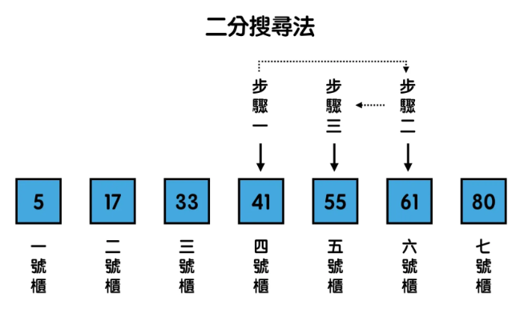

# 時間複雜度
1. 演算法的簡單定義：輸入 +演算法 = 輸出
2. 時間複雜度：衡量演算法執行好壞的工具
3. 大 O 符號：用來描述演算法在輸入 n 個東西時，所需時間與 n 的關係
4. 在 n 非常大時，好的演算法設計可以省下非常多時間
5. 演算法的速度不是以秒計算，而是以步驟次數
6. 實務上，我們只會紀錄最高次方的那一項，並忽略其所有的係數

---

# **目錄：常見的六種時間複雜度與演算法\**

https://medium.com/appworks-school/%E5%88%9D%E5%AD%B8%E8%80%85%E5%AD%B8%E6%BC%94%E7%AE%97%E6%B3%95-%E5%BE%9E%E6%99%82%E9%96%93%E8%A4%87%E9%9B%9C%E5%BA%A6%E8%AA%8D%E8%AD%98%E5%B8%B8%E8%A6%8B%E6%BC%94%E7%AE%97%E6%B3%95-%E4%B8%80-b46fece65ba5

## O(1)：陣列讀取
時間複雜度為 O(1) 的演算法，代表著不管你輸入多少個東西，程式都會在同一個時間跑完。


```
Pokemons = ["卡丘","胖丁","尼龜","比獸","呆獸","種子","小剛"]
    
n = 0
    
print(Pokemons[n])
    
>> "卡丘"
```
    
陣列讀取時，因為我們已經知道櫃子的索引值，不管放入的 n 等於多少，程式都可以在 “一個步驟” 就到達 n 所對應到編號的櫃子並取出該元素，像這樣的案例，我們就會說陣列讀取演算法的時間複雜度為 O(1)。
    

## O(n)：簡易搜尋
時間複雜度為 O(n) 的演算法，代表著執行步驟會跟著輸入 n 等比例的增加。例如當 n = 8，程式就會在 8 個步驟完成。
    
Pokemons 這一排櫃子裡有八隻神奇寶貝，假設每個櫃子的門都被關上，我們事前也不知道各個神奇寶貝的位置，這時如果想要知道「呆獸」神奇寶貝在哪裡時，我們第一個想到的方法會是什麼呢？
    
最直觀地想，我們會從第一個櫃子開始試，一次開一個櫃子，直到找到「呆獸」為止。像這樣的搜尋方法，就是最經典簡單的「簡易搜尋」。
    
```
Pokemons = ["卡丘","胖丁","尼龜","比獸","呆獸","種子","小剛"]
for Pokemon in Pokemons:
    if Pokemon == "呆獸":
        print("找到呆獸！")
        break
      else:
        print("這個櫃子裡不是呆獸")
```
    
觀察上面的程式碼時，我們可以發現，如果呆獸在第 0 號櫃，我們一個步驟就會找到它，但如果他是在第 6 號櫃，我們要花七個步驟才能找到他。
    
我們通常會用程式執行會碰到的「最壞狀況」來決定複雜度的表示，也因此，當我們要從 n 個櫃子中找到一隻特定的神奇寶貝，我們最慘最慘的情況需要花剛好 n 個步驟才能找到（想像要找的神奇寶貝在最後一個櫃子的情況）。像這樣的案例，我們就會說簡易搜尋演算法的時間複雜度為 O(n)。
    

## O(log n)：二分搜尋

時間複雜度為 O(log n) 的演算法（這邊的 log 都是以二為底），代表當輸入的數量是 n 時，執行的步驟數會是 log n。（讓忘記 log 是什麼的同學們複習一下，當 log n = x 的意思是 n = 2^x，如果這部分的腦細胞尚未復活，且讓我們先記住 n = 2^x，再來看看例子。）

舉例來說，當 n = 4，程式會在 2 個步驟完成（4 = 2²）；n = 16 時，程式會在 4 個步驟完成（16 = 2⁴），以此類推。

在程式中，O(log n) 的最常見例子是二分搜尋法。


假設有一長串有小到大排序好的數字們，我要在其中找特定一個數字，我們一樣可以從第一個往後一個一個檢查。但假設我們想要更珍惜生命，聰明的讀者可能已經想到了我們在「終極密碼」這種遊戲中會使用的策略，也就是每次都先檢查最中間的數字，如果中間的數字比我們要找的數字大，我們要找的數量就只剩原本的一半（因為在後段的數字顯然都會比我們要找的數字大），這樣的方法，就稱作二分搜尋法。



我們可以發現：二分搜尋法在每進行一個步驟時，就可以排除掉一半的可能性。每次都能減少一半，因此二分搜尋法最糟最糟也只需要以 2 為底的 log n 個步驟就能完成。
    
## O(nlogn)：合併排序
## O(n²)：選擇排序
## O(2^n)：費波那契數列