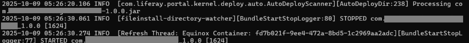

# Liferay 的「模組來源」有兩種

<br>

## 先釐清核心概念：Liferay 的「模組來源」有兩種
Liferay Portal 啟動時會載入模組（bundles），主要有兩個來源：

| 類型 | 說明 | 實際載入來源 |
| ---- | ---- | ------ |
| 靜態模組（Static Bundles）| Portal 內建的，例如 portal-kernel、frontend-theme-* 等。 | ```liferay-ce-portal-7.4.3.31-ga31/osgi/static``` |
| 動態模組（Dynamic Bundles） | 你自己開發的 module，例如 com.example.foo.api、service、web。 | 由 OSGi 載入，實際位置在： <br> ```liferay-ce-portal-7.4.3.31-ga31/osgi/state``` |

## 使用 Liferay Developer Studio 與其他 IDE 的差異：
- 若是透過 Liferay Developer Studio 部屬模組，它會將模組丟到 Portal 的 ```osgi/state``` 資料夾中。
- 若是透過 Visual Studio Code 部屬模組，它會將模組丟到 Portal 的 ```osgi/modules/``` 資料夾中，當 Portal 運行時，Liferay 會自動將它存入快取 ```osgi/state``` 中。

<br>


## ```./gradlew build``` 編譯的原理以及解析：
- 每個 modules 裡面有 bin 以及 build 資料夾。
    - bin：撰寫程式碼存檔後，會自動編譯成 .class 存在這。
    > (不論 Liferay Developer Studio 或 Visual Studio Code 都一樣)
    - build：下指令 ```./gradlew build``` 後，會存在這。
    > (Liferay Developer Studio 是在 start server 的時候)
- 部屬：
    - Liferay Developer Studio：啟動 start server 時，進行程式碼編譯，產生 ```modules/xxx/build/``` 資料夾(包含 ```classes/``` 以及 ```libs/```)，然後自動部屬到 ```osgi/state/``` 中。
    - Visual Studio Code：下指令 ```./gradlew build``` 進行程式碼編譯，產生 ```modules/xxx/build/``` 資料夾(包含 ```classes/``` 以及 ```libs/```)，然後手動複製 ```libs/``` 內的 jar 檔，到 ```deploy/```，Tomcat 會進行即時掃描，進行熱部屬。Tomcat 會將檔案搬移至 ```osgi/modules``` 然後更新 ```osgi/state```。
    - Tomcat 會出現如下提示：



    - 手動刪除 osgi/module/ ，會影響該 bundle 進行 stop，即停止運行。

