# Use DeveloperStudio

## STEP 1

下載專案 Source Code。

<br>

### ✍️ 附加內容

檢查 Gradle 版本:

1. 打開專案根目錄下的 ```gradle/wrapper/gradle-wrapper.properties```： 

    找到類似這一行，```distributionUrl``` 屬性會指定Gradle。

    Gradle Wrapper (```gradlew.bat```) 會自動下載這個版本。
    ```
    distributionUrl=https\://services.gradle.org/distributions/gradle-6.6.1-bin.zip
    ```

2. 執行 ```./gradlew -v``` 命令。

    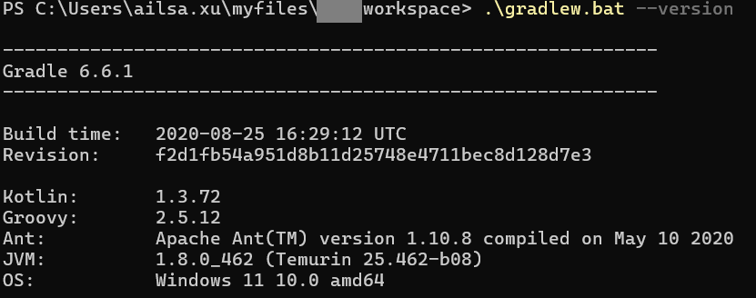

3. 對照專案要求

    如果 Wrapper 版本符合 ```gradle-wrapper.properties``` → 可以直接用 ```gradlew.bat build```。

4. 小技巧

    Wrapper 會自動下載正確版本到：

    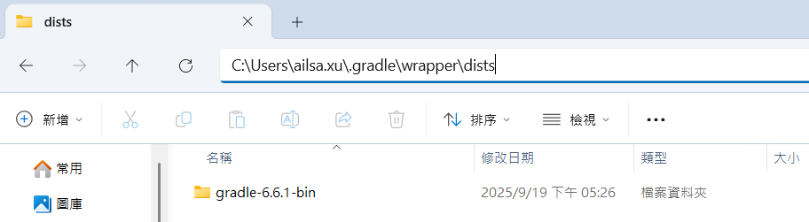

<br>

## STEP 2
將承上的專案，放在自己喜歡的路徑，並將專案改名為 ```xxx-workspace```。

我的路徑如下： 

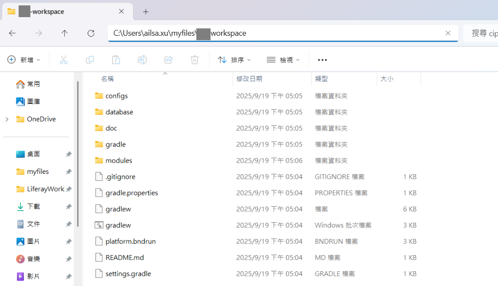

## STEP 3
將 ```gradle.properties``` 裡面的 jdk 位置改成正確位置。

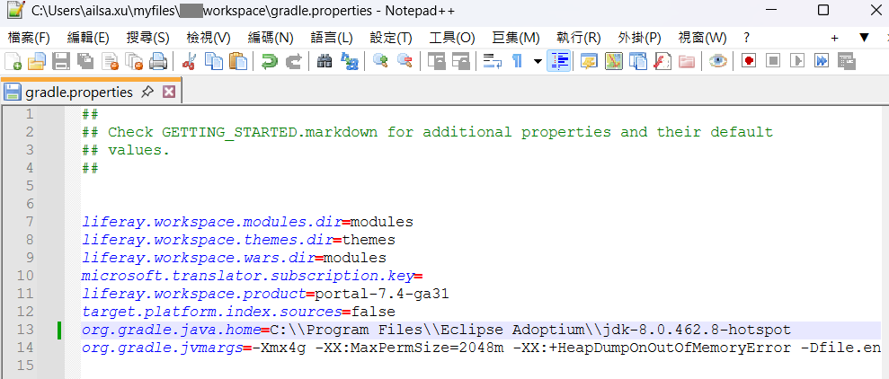


## STEP 4
雙擊啟動 ```DeveloperStudio```。

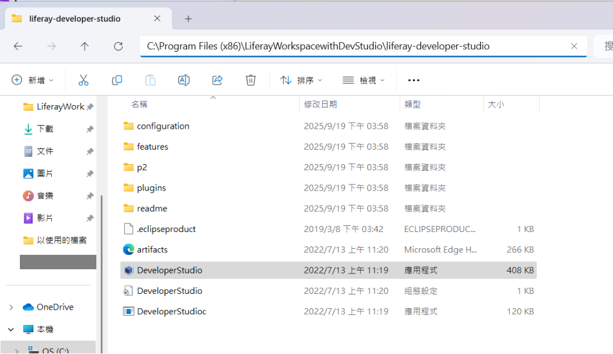


## STEP 5
隨意選擇一個空資料夾當作 Eclipse 的 Workspace，資料夾我命名為 ```my-workspace```。

這是 Eclipse 自己的工作區，只是 IDE 的容器，存放 IDE 的設定檔，跟 Liferay Workspace 無關。


## STEP 6
匯入 專案，選擇 ```Gradle``` > ```Existing Gradle Project```。

因為 Liferay Workspace 是 Blade CLI(Liferay 官方提供的命令列工具）建的，選 ```Existing Gradle Project``` 會比較好，IDE 會自動解析 ```settings.gradle``` 和各模組 ```build.gradle```。

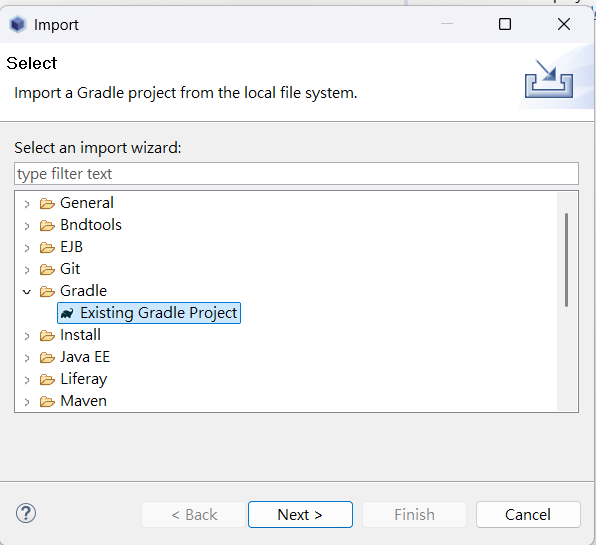

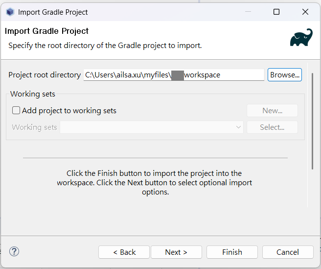

匯入需要一段時間。


## STEP 7
當選擇 Window>New Window後，左側的 Project Explorer 就會顯示完整的檔案路徑了（如下圖）。

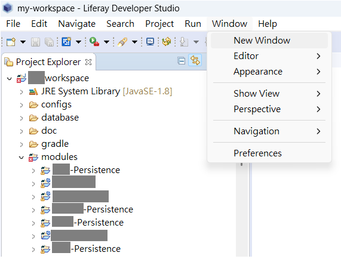


## STEP 8
New Liferay Server，並且手動指定 portal bundle 位置，透過 Deploy功能把模組丟進去。


選擇Liferay 7.x。

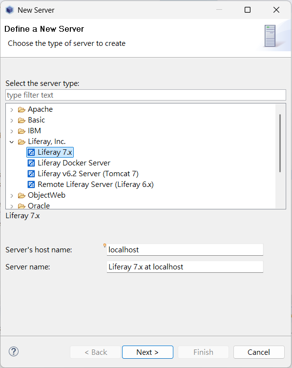

選擇 C槽，剛剛解壓縮後的 Liferay Portal（Tomcat）。

注意選擇到根目錄，裡面要有 ```tomcat-*``` 資料夾。

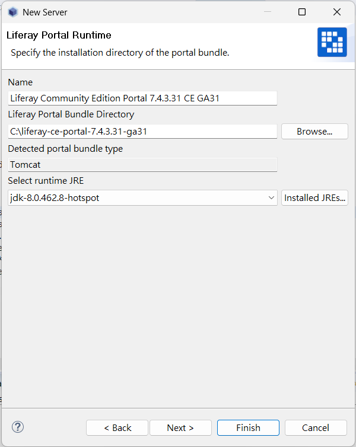


## STEP 9
啟動 Server，Dev Studio 會把 module 編譯結果直接放到 Liferay Portal (Tomcat) 的 ```deploy/``` 資料夾。

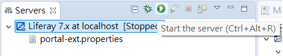

